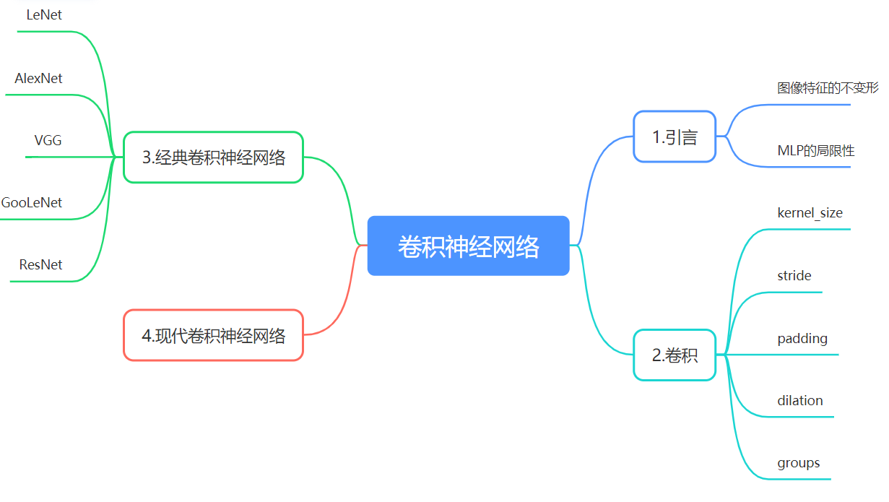
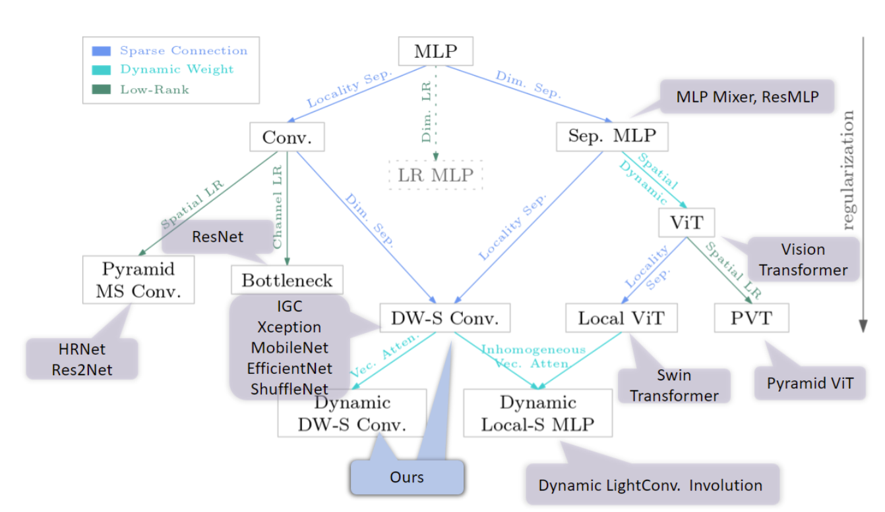

[TOC]


# 导图





# 引言

卷积神经网络（Convolutional Neural Networks，简称：CNN）是深度学习当中一个非常重要的神经网络结构。它更多的是用在图像图片处理，视频处理，音频处理以及自然语言处理等等。
早在上世纪80年代左右，卷积神经网络的概念就已经被提出来了。但其真正的崛起却是在21世纪之后，21世纪之后，随着深度学习理论的不断完善，同时，由于硬件性能的爆炸式提升，算力的不断增长等因素的促进，给卷积神经网络这种算法提供了大放异彩的空间。著名的AlphaGo，手机上的人脸识别，大多数都是采用卷积神经网络。因此可以说，卷积神经网络在如今的深度学习领域，有着举足轻重的作用。


## 图像特征的不变形

1.平移不变形


2.旋转不变形


3.缩放不变形


## MLP的局限性

在没有CNN以及更先进的神经网络的时代，朴素的想法是用多层感知机（MLP）做图片分类的识别。

**即将图片拉平后送入MLP进行分类。** 

```
input_img shape : (bs,3,224,224)  -> (bs,3*224*224)
if out_dim = 32
the parameters of Linear/Dense is  3*224*224*32  = 4816896 (bias=Flase)
```

这样会导致：

1. **MLP参数爆炸**
2. **没有合理利用图像特征（例如平移不变形），图像中每一个像素点的变化都会对分类结果产生很大的影响。**
3. **泛化能力差，容易过拟合，训练困难**

具体可以看下面链接

<a href = 'https://cloud.tencent.com/developer/article/1150162?fromSource=waitui'>使用MLP做图像分类(点击前往)</a>


<u>***tips： 在CNN出现之前，MLP做图像分类确实不行，但是随着计算机视觉的发展，在卷积神经网络的启发下，MLP又重新焕发生机，不少纯MLP的神经网络也逐渐爬上了ImageNet 竞赛的排行榜。 例如 MLP-Mixer，ResMLP***</u>


# 卷积

卷积作为卷积神经网络最基本的算子，它使得卷积神经网络能够具有以下特性：

1. 局部连接
2. 参数共享

<a href ='https://www.jianshu.com/p/bfa86361d1f2'>图文解释</a>

## 单通道的卷积

“卷积核”是做卷积运算的一个关键“组件”，同时也是网络的训练参数。本质上，它是一个矩阵，假设，这个矩阵是：
$$
\left[ \begin{matrix}
	1&		0&		1\\
	0&		1&		0\\
	1&		0&		1\\
\end{matrix} \right]
$$
然后，我们就可以按照下方这个动图所演示的这样，对输入的特征图（feature map）做滑动点乘求和，得到一张输出的特征图。


## 多通道的卷积

对于 有多个通道的输入特征，每一个卷积核都有与之匹配的通道个数。

简单理解：

1. 每个卷积核的通道数  =  输入特征的通道数
2. 每个卷积核产生一个输出特征的通道

<a  href = 'https://thomelane.github.io/convolutions/2DConvRGB.html'>动画演示</a>


## 参数理解

### 1.kernel_size

理解： 卷积核的尺寸


### 2.stride

理解：卷积核滑动的步长


### 3.padding

理解：对输入特征图在空间尺度上进行填充


### 4.dilation

理解： 空洞卷积，把卷积核劈叉

作用：增大感受野


 ### <a href='https://ezyang.github.io/convolution-visualizer/index.html'>动画演示</a>


### 5.groups(较为现代的卷积结构)

理解：对输入特征的通道进行分组，卷积操作只在每个组内进行，最后在通道维度上进行拼接。

1.输入特征通常的形状为： [bs, c ， h ， w ]

2.分组后 为  groups 个 [bs ，c//groups，h ，w] 

3.对每个 [bs， c//groups ，h ， w] 作为一张独立特征图 进行卷积操作

4.最后 将 groups 个 [bs，out_channel， h， w]  拼接为 [bs， groups * out_channel， h ，w]的特征图

作用：减少卷积层的参数，提高计算效率。

使用的groups convolution的论文：

<a href ='https://arxiv.org/abs/1611.05431'>ResNeXt</a>   	<a href='https://arxiv.org/abs/1707.01083'>shuffleNet</a>


### 6.深度可分离卷积（depth-wise + point-wise）

理解： 

1.point-wise 就是1x1卷积


2.depth-wise 就是 groups = in_channel 的分组卷积


3. point-wise + depth-wise

   

   使用的深度可分离卷积的网络：

   **MobileNet，shuffleNetV2，Xception  EfficientNet **（论文自己搜）

   作用：Rethink 卷积操作， 普通卷积其实可以就是在通道和空间尺寸上分别进行融合， 使用深度可分离卷积代替普通卷积能够大大减少网络的参数量同时提高计算速度，并且效果更好，广泛用于移动端网络的推理，是现代的卷积之一。

   ### 其他（开始卷起来了）

   **deformable convolution ，Dynamic convolution** 等等

   图出自论文<a href ='https://arxiv.org/abs/2106.04263'>On the Connection between Local Attention and Dynamic Depth-wise Convolution</a>论文从局部连接、权重共享和动态权重三个方面对深度卷积和局部自注意力进行了理论和详细的比较。下图是按照局部连接、权重共享、动态权重三个方面进行思考，总结了一下CV领域神经网络发展的趋势。

   例如里面提到了 主体为MLP的网络MLP-Mixer 以及最近很火的基于transformer结构的ViT 和Swin-transformer 

   最近卷积发展的趋势 也是 逐渐地走向动态的卷积。

   

   

   

   

   # 经典的卷积神经网络

   ## LeNet

   最早用于商用的卷积神经网络，用来识别手写数字

   

   ## AlexNet (2012 ILSVRC 冠军)

   第一个现代深度卷积神经网络模型

   1. 首次使用GPU并行训练
   2. 采用ReLU作为非线性激活函数
   3. 使用Dropout防止过拟合
   4. 使用数据增强，提高准确率
   5. 提出局部响应归一化，增强模型的泛化能力（后面发现这玩意好像没什么用）

   

   ## VGGNet(2014 ILSVRC 亚军)

   大量使用了3x3卷积

   3x3 卷积的优点：

   1.多个3x3卷积层比大尺寸filter卷积层具有更多的非线性，使得判决函数更具判决性

   2.多个3x3卷积层比大尺寸filter卷积层具有更少的参数， 例如使用2个3x3 卷积代替 1个5x5卷积 ，使用3个3x3卷积代替1个7x7卷积
   $$
   outH\,\,=\,\,\frac{inH\,\,-\,\,kernel\_size\ +2\ *padding}{stride}\,\,+\,\,1
   $$
   假设  输入特征图的尺寸为 5x5   ，经过 一个 *stride = 1,   padding=0* 的*3x3*卷积之后 size 为   （3,3） ，在经过一个 3x3卷积 变成（1,1）；两个3x3卷积层的参数为  3 × 3 × 3  = 18 而 一个5x5卷积层的参数为 5×5 = 25 （假设输入 输出的通道维度一样 都是1）

   

   

   


## GooLeNet（inception网络）（2014 ILSVRC  冠军）

**提出：如果不知道用什么大小的卷积核 那我就都做一遍**


**参数量太大了！！！**


**先做1x1卷积 降低feature map 的通道数 再做不同的卷积**


**1 x 1 卷积的优点：**

1. 改变feature map的通道数量（降维或升维）
2. 增加了网络的深度，通过ReLU进行非线性变化，增加了网络的非线性能力


**引入了 中间辅助Loss单元， 利用中间层抽取的特征，增强了网络的性能。**


## ResNet（2015  ILSVRC 冠军  里程碑）

观察发现，随着网络深度的增加，网络的性能越好（图为错误率）


**idea： 增加网络的深度！**

**But：** 然而现实是残酷的，随着网络深度的增加，性能反而更差了，原因是因为深层网络存在着梯度消失或者爆炸的问题，这使得深度学习模型很难训练。


### 神一样的残差连接（Resiual is all you need）


![[公式]](https://www.zhihu.com/equation?tex=%5Cfrac%7B%5Cpartial+loss%7D%7B%5Cpartial+%7B%7Bx%7D_%7Bl%7D%7D%7D%3D%5Cfrac%7B%5Cpartial+loss%7D%7B%5Cpartial+%7B%7Bx%7D_%7BL%7D%7D%7D%5Ccdot+%5Cfrac%7B%5Cpartial+%7B%7Bx%7D_%7BL%7D%7D%7D%7B%5Cpartial+%7B%7Bx%7D_%7Bl%7D%7D%7D%3D%5Cfrac%7B%5Cpartial+loss%7D%7B%5Cpartial+%7B%7Bx%7D_%7BL%7D%7D%7D%5Ccdot+%5Cleft%28+1%2B%5Cfrac%7B%5Cpartial+%7D%7B%5Cpartial+%7B%7Bx%7D_%7Bl%7D%7D%7D%5Csum%5Climits_%7Bi%3Dl%7D%5E%7BL-1%7D%7BF%28%7B%7Bx%7D_%7Bi%7D%7D%2C%7B%7BW%7D_%7Bi%7D%7D%29%7D+%5Cright%29)

残差单元 Identity：


残差单元BottleNeck


**在VGG基础上改进**


